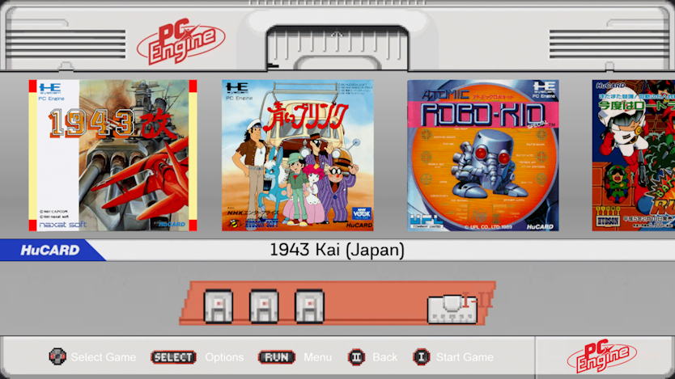
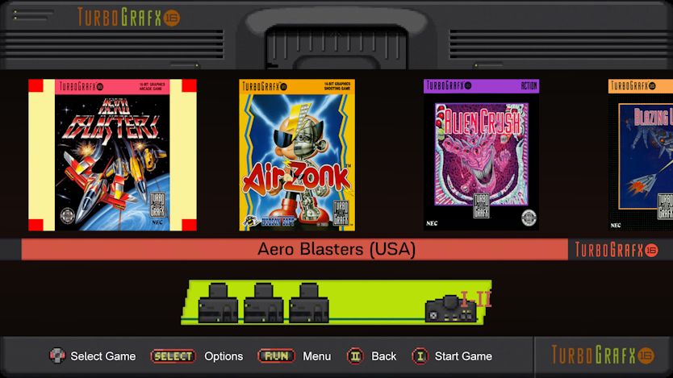
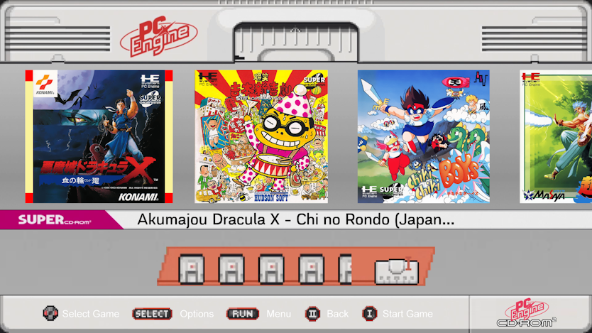
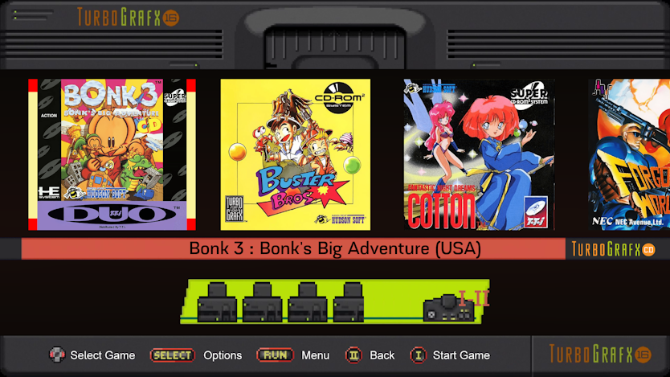
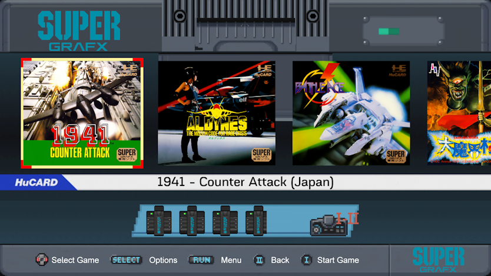

# Tg16-mini Theme for EmulationStation

Tg16-mini is an EmulationStation version 6 compatible theme for Retropie.

This theme was designed to mimic the look and feel of the [TurboGrafx-16 Mini](https://en.wikipedia.org/wiki/TurboGrafx-16_Mini) interface. PC Engine, TurboGrafx-16, PC Engine CD, TurboGrafx CD, and SuperGrafx systems are supported. Non-supported systems will use the TurboGrafx-16 artwork.

    

Based on ['RetroPythin(TG16)' - 02-05-2021 by RetroPython](https://www.youtube.com/watch?v=tuXd4AXhMMQ).
